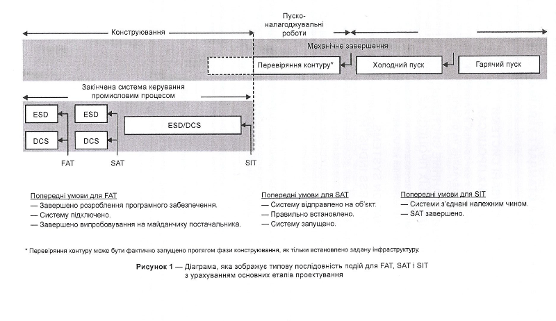

| ENG                                                          | УКР                                                          | Примітка            |
| ------------------------------------------------------------ | ------------------------------------------------------------ | ------------------- |
| **factory acceptance test (FAT)**                            | **приймальні випробування виробника**                        | ****                |
| activity to demonstrate that the vendor system and additionally supplied systems are in accordance with the specification | Заходи, здійснювані для того, щоб продемонструвати, що система, яка  постачається, та додаткові підтримувальні системи відповідають специфікації | ДСТУ ІЕС 62381 2010 |

