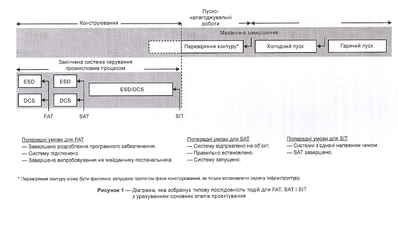

| ENG                                                          | УКР                                                          | Примітка            |
| ------------------------------------------------------------ | ------------------------------------------------------------ | ------------------- |
| **site acceptance test (SAT)**                               | **приймальні випробування на об’єкті**                       | ****                |
| activity to demonstrate that the installation of the various vendor systems are in accordance with the applicable specifications and installation instructions | Заходи, здійснювані для того, щоб продемонструвати, що системи різних постачальників відповідають застосовуваним специфікаціям та інструкціям із встановлення | ДСТУ ІЕС 62381 2010 |

