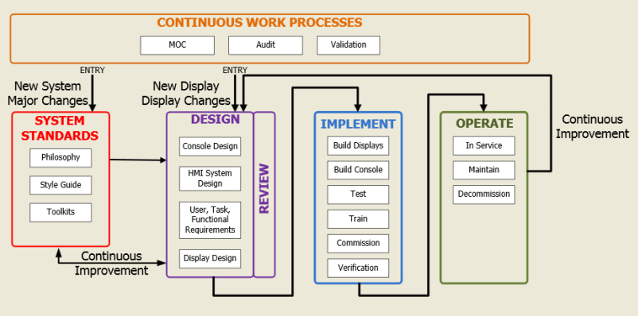
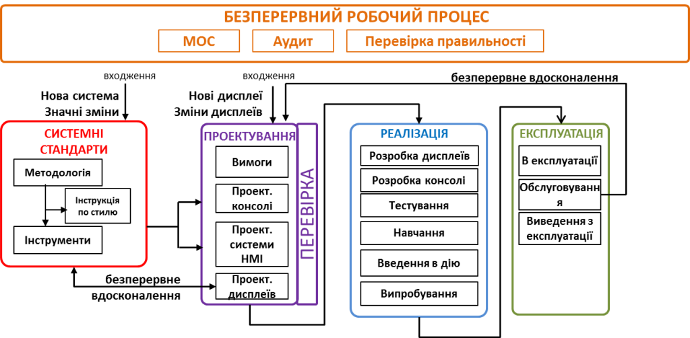

| ENG                                                          | УКР                                                          | Примітка                                      |
| ------------------------------------------------------------ | ------------------------------------------------------------ | --------------------------------------------- |
| **Commissioning**                                            | **Введення в дію**                                           | **Введення в дію**                            |
| Procedures prior, or related, to handing over a system for placing into service. These procedures often include acceptance testing (FAT, SAT and SIT); handing over of drawings and documentation; delivering instructions for operation, maintenance, and repair; and providing training to personnel. | Процедури, що передують або пов'язані з передачею системи для введення в експлуатацію. Ці процедури часто включають: тестові випробування (FAT, SAT та SIT); здача креслень та документації; надання інструкцій з експлуатації, технічного обслуговування та ремонту; забезпечення навчання персоналу. | Стадія "Введення в дію" згідно ГОСТ 34.601.90 |

