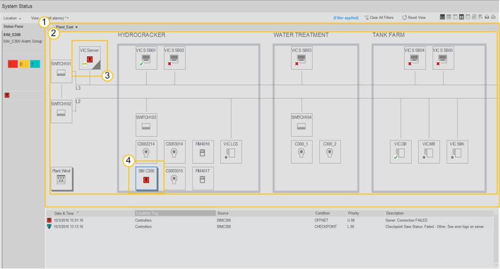

| ENG                                                          | УКР                                                          | Примітка |
| ------------------------------------------------------------ | ------------------------------------------------------------ | -------- |
| **Dashboard**                                                | **Панель приладів**                                          |          |
| A graphical summary showing various pieces of important information typically used to give an overview of a process or part of a process. | Комбінація графічних елементів, яка показує різні фрагменти важливої інформації, що зазвичай використовуються для огляду процесу чи його частини. |          |

У стандарті ISA-101 нагадування про Dashboard зустрічається тільки в 2-х місцях: в типах сторінок (як синонім функціональному огляду) і в тексті як один із навігаційних методів. На прикладах (див <a  href="https://www.honeywellprocess.com/library/support/Public/Documents/HMIWeb-Display-Building-Guide-EXDOC-XX54-en-500A.pdf"> Honeywell</a> ) це може мати вигляд як на рис. Для Dashboard  використовується техніка заглиблення (driil-down) при якому клікнувши по одному компоненту - попадаєш на дисплей іншої панелі приладів. 

1 - Dashboard pane, 2 - Dashboard,  3 - System component, 4 - Link to another dashboard 