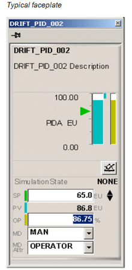

| ENG                                                          | УКР                                                          | Примітка |
| ------------------------------------------------------------ | ------------------------------------------------------------ | -------- |
| **Faceplate**                                                | **Лицьова панель**                                           |          |
| A display, part of a display, or popup used for monitoring and/or direct operation of a single control loop, device, sequence, or other entity. | Дисплей, частина дисплея або спливаюче вікно, що використовується для моніторингу та/або виконання дії для одного контуру керування, пристрою, послідовності чи іншої сутності. |          |

У стандарті немає зображення для таких засобів. Але за загальною інформацією, такі компоненти зв'язуються з якоюсь стандартною сукупністю тегів, наприклад з параметрами і змінними ПІД-регулятору (див <a  href="https://www.honeywellprocess.com/library/support/Public/Documents/HMIWeb-Display-Building-Guide-EXDOC-XX54-en-500A.pdf"> Honeywell</a> ). Згідно стандарту ISA-101 лицьові панелі займають частину основного екрану, на відмінну від спливаючих сторінок. Тому вони завжди відображають вибраний наразі контекст.

