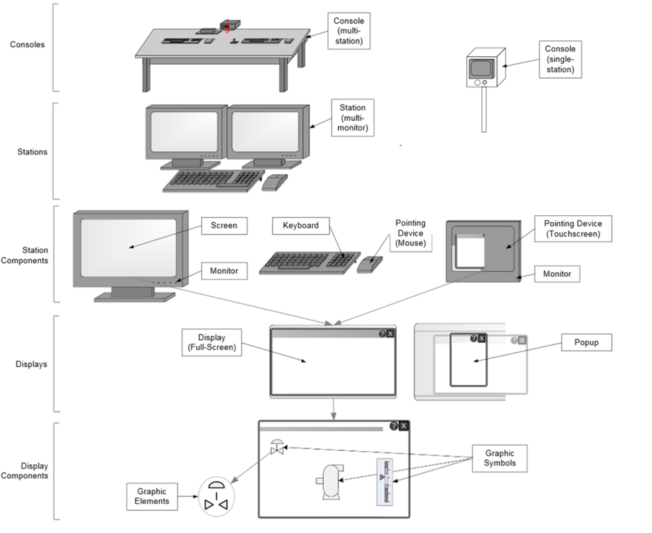

| ENG                                                          | УКР                                                          | Примітка |
| ------------------------------------------------------------ | ------------------------------------------------------------ | -------- |
| **Graphic element**                                          | **Графічний символ**                                         |          |
| A component part of a graphic symbol, such as a line or circle. | Складова частина <a href="Graphic symbol.md">графічного символу</a> , наприклад лінія або коло. |          |

