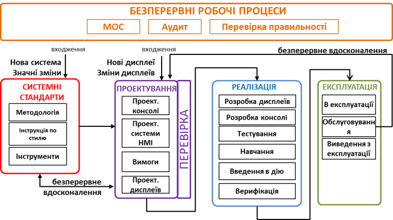

| ENG                                                          | УКР                                                          | Примітка |
| ------------------------------------------------------------ | ------------------------------------------------------------ | -------- |
| **Validation (Qualification)**                               | **Перевірка правильності**                                   | ****     |
| Process of demonstrating by examination, testing, or other objective evidence that the HMI, as installed, meets applicable requirements and specifications. NOTE Requirements and specif calions include HMI Philosophy, HMI Style Guide, and User, Task and Functional Requirements. | Процес демонстрації шляхом перевірки, тестування чи інших об'єктивних доказів того, що встановлений HMI відповідає застосованим вимогам та технічним специфікаціям. ПРИМІТКА Вимоги та характеристики включають методологію HMI, інструкція зі стилю HMI,  користувацьккі вимоги, вимоги до задач та функцій. |          |

